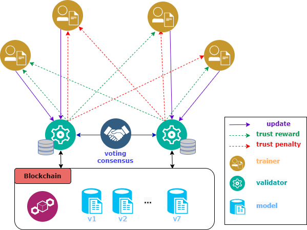

# FLoBC
Federated Learning over Blockchain. <br><br>
This project supports the training of stochastic gradient descent models over blockchain. <br><br>
Training and validation is performed on the user's local data. Nodes share insights or gradients rather than data. <br><br>
The system utilizes a reward/punishment policy to incentivize legitimate training, and to punish and hinder malicious trainers. <br><br>
<br><br>
As it can be seen in the figure. Trainers perform training, then share their updates with the validators that validate the updates and perform consensus. After which trainers are given a trust reward or pentaly, and a new model is added to the blockchain. <br><br>
For more details about the system, check [the slides](https://docs.google.com/presentation/d/1koIePQY4zOhS8jltEeFZ27Q99Ua_KlZIDUb6Zcn_VCI/edit?usp=sharing) and [this video](https://drive.google.com/file/d/1e6TVJ5_nI7mPKt9JTVXy2bMrMx7xXkqG/view?usp=sharing). 

## Prerequisites
- git clone https://github.com/Oschart/FDMMLS.git
- npm 
- node https://nodejs.org/en/download/
- babel 
``` shell
$ npm install -g babel-cli
```

## To Run the Tool

### Using GUI
##### Install the prerequisites
``` shell
$ npm install express
$ npm install 
````

##### To run the web service
``` shell
$ cd frontend/src/components
$ node service.js
$ cd ../..
````

``` shell
$ cd frontend
$ npm start
````

###### Initialization Form
To configure the system


###### Progress Monitoring


###### Demo Video
<a href="https://drive.google.com/file/d/1indstlHqPbDn9WctNczFZVVRBCU-5qbf/view?usp=sharing"></a>

### Using Scripts
Using the [spawn script](./scripts/spawn/spawn.sh), you can run the system with certain number of trainers, validators, synchronization scheme and training period.
For instructions on how to run the spawn script, [check](./scripts/spawn/README.md)

### Manually

##### To build the rust code and/or the validating node
``` shell
$ cd backend
$ sh build_finalize.sh -n <number of validating nodes> -b -c -j 
$ cd ..
````
- -b is used to build rust
- -c is used to clear the blockchain
- -j is used to build the node.js validator

##### To run the validating node
``` shell
$ cd backend
$ sh run_node <node number> <sync scheme> <scoring flag> <model directory name>
$ cd ..
````
##### To build the lightclient 
``` shell
$ cd lightclient
$ npm install
$ npm start -- <validator port number> <dataset past> <trainer noise> <model directory name> 
```

## To use the provided models, you need:
- python >= 3
- tensorflow
- keras
- numpy
- pandas

## To use the provided MNIST 28x28 models, download MNIST data
https://www.kaggle.com/oddrationale/mnist-in-csv

## To use the provided MNIST 20x20 models:
resize the downloaded data using [this script](./dataset utils/MNIST_resize.py) <br>
or download it from [here](https://drive.google.com/drive/folders/1tOyb5J4kDwkOA8ML0Ub-gmj-b44LvMzU?usp=sharing)

- N.B. Place training data in ./lightclient/models/MODEL_NAME/
- N.B. Place test data in ./backend/tx_validator/src/models/MODEL_NAME/data.csv

## Authors
* **Mohamed Oscar** [Oschart](https://github.com/Oschart)
* **Fadi Adel** [theRadFad](https://github.com/theRadFad)
* **Habiba Gamal** [habibagamal](https://github.com/habibagamal)
* **Eslam Soliman** [Eslam-Soliman](https://github.com/Eslam-Soliman)
* Dr. Hossam Sharara
* Dr. Tamer ElBatt
